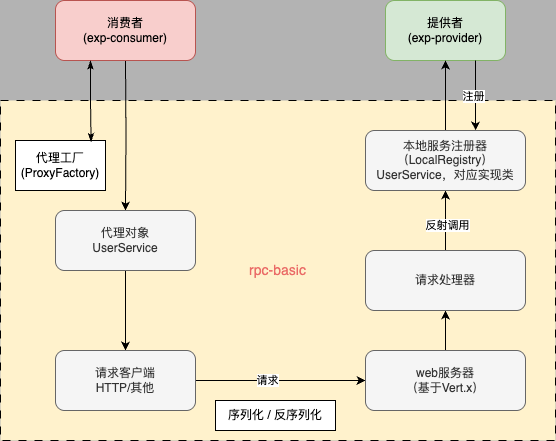

# 简易版 RPC 框架

### 开发自己的 PRC 框架

* 什么是 PRC ？
  * 专业定义：RPC（Remote Procedure Call）即远程过程调用，是一种计算机通信协议
  * 它允许程序在不同的计算机之间 进行通信和交互，就像本地调用一样。
  * 本身不是一种协议，而是一种调用
  * 常用的 RPC 协议实现： 
    * gRPC 
    * thrift

* 为什么需要 RPC ？
  * 开发者使用 RPC 框架，可以轻松调用远程服务，快速开发分布式系统
  * 而不需要了解数据的传输处理过程、底层网络通信的细节等

### 源码目录

* exp-common：示例代码的公共依赖，包括接口、Model 等
* exp-consumer：示例服务消费者代码
* exp-provider：示例服务提供者代码
* fay-rpc-basic：简易版 RPC 框架

### 项目介绍
- 参考 Dubbo 开源项目自主设计实现的 Java 高性能 RPC 框架。
- 后续将扩展：
  - 开发者只需引入 Spring Boot Starter，就能通过注解和配置的方式快速使用框架，实现像调用本地方法一样轻松调用远程服务。 
  - 基于 Vert.x TCP 服务器+自定义协议实现网络传输； 
  - 基于Etcd实现注册中心以完成服务的注册消费； 
  - 还支持通过 SPI 机制动态扩展序列化器、负载均衡器、重试和容错策略等。

##### [框架架构图](fay-rpc-basic.png)

